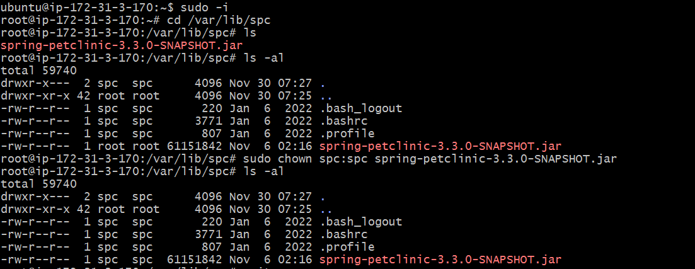
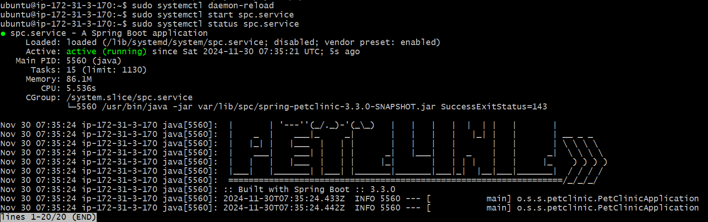
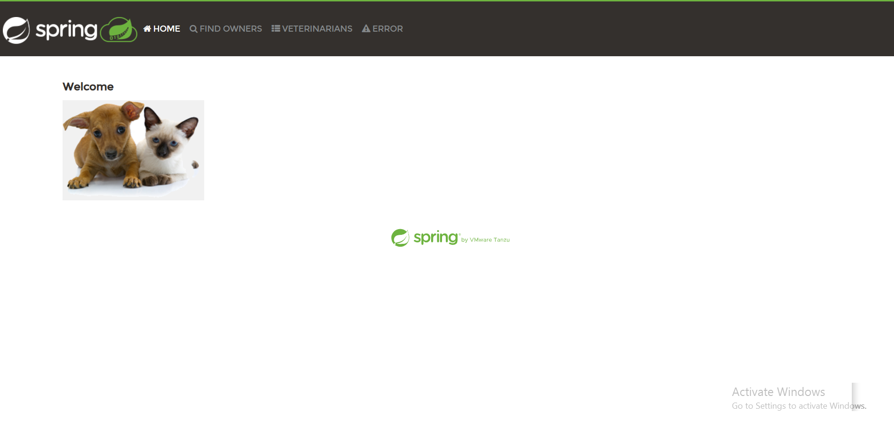

# Spring Boot Clinic Application - Running as a Service

Running an application as a **service** ensures reliability, consistency, and availability, making it essential for production environments. Running it as an **application** is suitable for quick setups, development, and testing purposes.

This guide provides detailed steps to configure and run the Spring Boot Clinic application as a service on a Linux system using **Systemd**.

---

## Prerequisites

1. **Java Runtime**: Ensure Java17 is installed.

   ```bash
    sudo apt update
    sudo apt install openjdk-17-jdk
   ```

2. **Download Jar file:**
   [spc-jar file](https://pet-clinic-bucket.s3.ap-south-1.amazonaws.com/spring-petclinic-3.2.0-SNAPSHOT.jar)

```bash
  sudo wget https://pet-clinic-bucket.s3.ap-south-1. amazonaws.com/spring-petclinic-3.2.0-SNAPSHOT.jar
```

3. **Create an User:**

```
# Name: spc
# Homedirectory: /var/lib/spc
  sudo useradd -d '/var/lib/spc' -m -s '/bin/sh' spc
```

4. **Download the jar file in the homedirectory**

```
sudo wget https://pet-clinic-bucket.s3.ap-south-1.amazonaws.com/spring-petclinic-3.2.0-SNAPSHOT.jar
```

5. **Change the Ownership for spc user**

```
sudo -i
cd /var/lib/spc
ls -al
sudo chown spc:spc spring-petclinic-3.2.0-SNAPSHOT.jar
ls -al
```


6. **Now create a Systemd service file in the following location**
   `name : spc.service `

Create a service file for the application under /etc/systemd/system/.

```
sudo -i
sudo vi /usr/lib/systemd/system/spc.service
```

```
[Unit]
Description=A Spring Boot application
After=syslog.target
[Service]
User=spc
ExecStart=/usr/bin/java -jar /var/lib/spc/spring-petclinic-3.2.0-SNAPSHOT.jar SuccessExitStatus=143

[Install]
WantedBy=multi-user.target
```

7. **Reload the Systemd Daemon**

```
sudo systemctl daemon-reload
```
8. **Start and Enable the Service**
```
sudo systemctl start spc.service
```
```
sudo systemctl enable spc.service
```
9. **Verify the Service Status**
```
sudo systemctl start spc.service
```

10. **Run the Application**
 - Here spc will run on port:8080
 ```
 http://<ip-address>:8080
 ```


This is how application will be running using service.

#### lets write an playbook for above application as follows.


